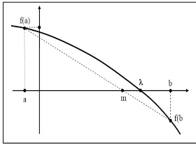
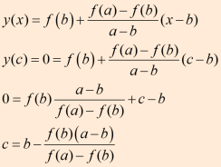

# **MENCARI AKAR PERSAMAAN**

Dalam matematika dan komputasi, algoritma pencarian akar adalah algoritma untuk menemukan nol, juga disebut "root", dari fungsi kontinu. Nol fungsi *f*, dari bilangan real ke bilangan real atau dari bilangan kompleks ke bilangan kompleks, adalah bilangan x sedemikian rupa sehingga *f*(*x*) = 0. 


### **1. Metode Bisection**

Bisection adalah algoritma pencarian akar pada sebuah interval. Interval tersebut membagi dua bagian, lalu memilih dari dua bagian ini dipilih bagian mana yang mengandung akar dan bagian yang tidak mengandung akar dibuang. Hal ini dilakukan berulang-ulang hingga diperoleh akar 
persamaan atau mendekati akar persamaan. Metode ini berlaku ketika ingin memecahkan persamaan *f*(*x*) = 0 dengan *f* merupakan fungsi kontinyu.


Rumus bisection : ***f*(a)\**f*(b) <** **0**

Prosedur Metode Bagi-Dua :

- Misal dijamin bahwa *f(x)* adalah fungsi kontinyu pada interval [a, b]  dan *f*(a)*f*(b) < 0. Ini artinya bahwa *f(x)* paling tidak harus memiliki  akar pada interval [a, b].
- Kemudian definisikan titik tengah pada interval [a, b] yaitu c :=.  Dari sini kita memperoleh dua subinterval yaitu [a, c] dan [c, b].
- Setelah itu, cek apakah *f*(a)*f*(c) < 0 atau *f*(b)*f*(c) < 0 ? 
  - Jika *f*(a)*f*(c) < 0 maka b = c (artinya titik b digantikan oleh  titik c yang berfungsi sebagai titik b pada iterasi berikutnya),
  - jika tidak maka a = c. Dari iterasi pertama kita memperoleh interval [a, b] yang baru dan titik tengah c yang baru.
- Kemudian lakukan pengecekan lagi seperti sebelumnya sampai memperoleh error yang cukup kecil.


```py
def bisection(f,a,b,N):
    
    if f(a)*f(b) >= 0:
        print("Bisection method fails.")
        return None
    a_n = a
    b_n = b
    for n in range(1,N+1):
        m_n = (a_n + b_n)/2
        f_m_n = f(m_n)
        if f(a_n)*f_m_n < 0:
            a_n = a_n
            b_n = m_n
            print ("a = ",a_n)
            print ("b = ",b_n)
        elif f(b_n)*f_m_n < 0:
            a_n = m_n
            b_n = b_n
            print ("a = ",a_n)
            print ("b = ",b_n)
        elif f_m_n == 0:
            print("Found exact solution.")
            return m_n
        else:
            print("Bisection method fails.")
            return None
    return (a_n + b_n)/2

f = lambda x: x**2 - 5*x +6
approx_phi = bisection(f,1,2.5,25)
print("x = ",approx_phi)
##error_bound = 2**(-26)
##print(error_bound)
##print(abs( (1 + 5**0.5)/2 - approx_phi) < error_bound)

```

contoh running

```py
a =  1.75
b =  2.5
a =  1.75
b =  2.125
a =  1.9375
b =  2.125
a =  1.9375
b =  2.03125
a =  1.984375
b =  2.03125
a =  1.984375
b =  2.0078125
a =  1.99609375
b =  2.0078125
a =  1.99609375
b =  2.001953125
a =  1.9990234375
b =  2.001953125
a =  1.9990234375
b =  2.00048828125
a =  1.999755859375
b =  2.00048828125
a =  1.999755859375
b =  2.0001220703125
a =  1.99993896484375
b =  2.0001220703125
a =  1.99993896484375
b =  2.000030517578125
a =  1.9999847412109375
b =  2.000030517578125
a =  1.9999847412109375
b =  2.0000076293945312
a =  1.9999961853027344
b =  2.0000076293945312
a =  1.9999961853027344
b =  2.000001907348633
a =  1.9999990463256836
b =  2.000001907348633
a =  1.9999990463256836
b =  2.000000476837158
a =  1.999999761581421
b =  2.000000476837158
a =  1.999999761581421
b =  2.0000001192092896
a =  1.9999999403953552
b =  2.0000001192092896
a =  1.9999999403953552
b =  2.0000000298023224
a =  1.9999999850988388
b =  2.0000000298023224
x =  2.0000000074505806
```


### **2. Metode Newtoon - Raphson**

Metode Newton-Raphson adalah sebuah metode yang tentu saja ditemukan oleh Issac Newton melalui sebuah pendekatan yang menggunakan satu titik awal dan mendekatinya dengan memperhatikan kemiringan kurva pada titik tersebut. Penjelasan grafis mengenai lebih lanjut terhadap metode ini bisa dilihat pada gambar dibawah ini.


Diasumsikan bahwa fungsi *f(x)* adalah kontinu. Idenya adalah menghitung akar yang merupakan titik potong antara sumbu x dengan garis singgung pada kurva di titik (xn-1; *f* (xn-1)). Kemiringan kurva di titik tersebut adalah *f”*(xn-1), sehingga garis singgung mempunyai persamaan sebagai berikut :


karena itu maka diperoleh sebuah akar perkiraan dengan mengambil sebuah nilai y = 0, sehingga akan menghasilkan sebuah persamaan lagi yang baru yaitu :


```py
def newton(f,Df,x0,epsilon,max_iter):
    xn = x0
    for n in range(0,max_iter):
        fxn = f(xn)
        if abs(fxn) < epsilon:
            print('Found solution after',n,'iterations.')
            return xn
        Dfxn = Df(xn)
        if Dfxn == 0:
            print('Zero derivative. No solution found.')
            return None
        xn = xn - fxn/Dfxn
    print('Exceeded maximum iterations. No solution found.')
    return None
p = lambda x: x**3 - x**2 - 1
Dp = lambda x: 3*x**2 - 2*x
approx = newton(p,Dp,1,1e-10,10)
print(approx)
##f = lambda x: x**(1/3)
##Df = lambda x: (1/3)*x**(-2/3)
##approx = newton(f,Df,0.1,1e-2,100)

```

contoh running

```py
Found solution after 6 iterations.
1.4655712318767877
```

### 3. Metode Regula - Falsi

Metode Regula Falsi adalah salah satu metode numerik yang digunakan untuk mencari akar dari suatu persamaan dengan memanfaatkan kemiringan dan selisih tinggi dari dari dua titik batas range. Sebenarnya metode ini hampir sama dengan Metode Biseksi, tapi titik pendekatan yang digunakan pada metode ini berbeda dengan Metode Biseksi. Rumus titik pendekatan tersebut adalah :

 

Keterangan :

a = X0
b = X1
m = X2

Metode regula falsi merupakan salah satu metode  tertutup untuk menentukan solusi akar dari persamaan non linier. Berikut  langkah penyelesaiannya :

1) Tentukan interval [X0, X1] yang memuat akar

2) Tentukan titik X2 dengan menarik garis lurus dari titik [X0, *f*(X0)] ke titik [X1, *f*(X1)] titik X2 adalah titik potong garis dengan sumbu X.

X2 = X0 * *f*(X1) - X1 * *f*(X0) / *f*(X1) - *f*(X0)

X2 = X1 - [ (X1 -X0) / *f*(X1) - *f*(X0) ] * *f*(X1) [P] X2 = X1 - P * *f*(X1)

3) Suatu kondisi bila :

*f*(X0) * *f*(X2) < 0 Maka akar pada [X0, X2] , X2 = X1

*f*(X0) * *f*(X2) = 0 akar = X2

*f*(X0) * *f*(X2) > 0 Maka akar pada [X2, X1], X2 = X0

4) Pengulangan / iterasi mencari X2 dan interval baru dilakukan berdasarkan nilai toleransi | (X2 - X)1 / X1 | atau | (X2 - X0) / X0 |

5) Kelemahan : Hanya salah satu ujung titik interval ( X0 atau X1 ) yang bergerak menuju akar dan yang lain selalu tetap untuk setiap iterasi [ nilai bersifat mutlak ]

```py
error = 0.01
a = 0
b = 2.1

def f(x):
    return x**2 - 5*x + 6

def regulasi_falsi(a,b):
    i=0
    max_iter = 50
    iteration = True
    while iteration and i < max_iter:
        if f(a)*f(b) < 0:
            x = (a*abs(f(b)) + b*abs(f(a))) / (abs(f(a)) + abs(f(b)))
            if f(a)*f(x) < 0:
                b = x
                print(x)
            if f(x)*f(b) < 0:
                a = x
                print(x)
            if abs(a-b) < error:
                iteration = False
            else:
                i+=1
        else:
            print('tidak di temukan akar')
    print('x =', x)
    

regulasi_falsi(a,b)

```

Contoh Running

```py

2.0689655172413794
2.047058823529412
2.03187250996016
2.0214765100671146
2.0144209103199646
2.009660377358491
2.0064610569885417
2.004316668071832
2.0028819254864656
2.0019231310978185
2.0012829097997895
2.0008556391024563
2.0005705888076695
2.0003804649014514
2.0002536754391684
2.000169131260928
2.0001127605310622
2.000075176513023
2.0000501189312705
2.0000334131790583
2.000022275700806
2.0000148505774735
2.0000099004339917
2.00000660031111
2.0000044002170876
2.0000029334823615
2.0000019556568196
2.0000013037720628
2.000000869181753
2.00000057945467
2.0000003863031877
2.000000257535491
2.000000171690342
2.0000001144602346
2.0000000763068257
2.000000050871219
2.0000000339141466
2.0000000226094317
2.000000015072955
2.000000010048637
2.000000006699091
2.000000004466061
2.0000000029773735
2.000000001984916
2.0000000013232775
2.000000000882185
2.0000000005881233
2.0000000003920824
2.000000000261388
2.000000000174259
x = 2.000000000174259
```


### **4. Metode Secant**

Metode secant merupakan perbaikan dari metode regula-falsi dan newton raphson dimana kemiringan dua titik dinyatakan sacara diskrit, dengan mengambil bentuk garis lurus yang melalui satu titik. Tujuan metode secant adalah untuk menyelesaikan masalah yang terdapat pada metode Newton-Raphson yang terkadang sulit mendapatkan turunan pertama yaitu *f‘ (x)*. Fungsi metode secant adalah untuk menaksirkan akar dengan menggunakan diferensi daripada turunan untuk memperkirakan kemiringan/slope.


***f’ (x)* = ( *f (xn)* – *f (xn-1))* / *(xn – xn-1)***
**xn+1 = xn – ( (*f(xn) (xn – xn-1)) / ( *f(xn) -f(xn-1)* )**

**Algoritma Metode Secant :**

1. Definisikan fungsi *f(x)*
2. Definisikan torelansi error (e) dan iterasi maksimum (n)
3. Masukkan dua nilai pendekatan awal yang di antaranya terdapat akar yaitu x0 dan x1,sebaiknya gunakan metode tabel atau grafis untuk menjamin titik pendakatannya adalah titik pendekatan yang 
   konvergensinya pada akar persamaan yang diharapkan.
4. Hitung *f(x0)* dan *f(x1)* sebagai y0 dan y1
5. Untuk iterasi I = 1 s/d n atau |*f(xn)*|
   Xn+1 = Xn – Yn (Xn – Xn-1 / Yn – Yn-1)
6. Akar persamaan adalah nilai x yang terakhir.

```py
def secant(f,a,b,N):
    if f(a)*f(b) >= 0:
        print("Secant method fails.")
        return None
    a_n = a
    b_n = b
    for n in range(1,N+1):
        m_n = a_n - f(a_n)*(b_n - a_n)/(f(b_n) - f(a_n))
        f_m_n = f(m_n)
        if f(a_n)*f_m_n < 0:
            a_n = a_n
            b_n = m_n
        elif f(b_n)*f_m_n < 0:
            a_n = m_n
            b_n = b_n
        elif f_m_n == 0:
            print("Found exact solution.")
            return m_n
        else:
            print("Secant method fails.")
            return None
    return a_n - f(a_n)*(b_n - a_n)/(f(b_n) - f(a_n))

p = lambda x: x**2 - 5*x + 6
print(p(1))
print(p(2))
approx = secant(p,1,2.5,25)
print(approx)

```

Contoh running

```py
2
0
2.0000000149011603
```

