# **ROMBERG METHOD**

Metode Romberg adalah metode perhitungan yang didasarkan trapezional rule dan error calcultion sehingga dapat menghasilan nilai integral dengan tingkat presisi yang tinggi. Metode integrasi Romberg didasarkan pada perluasan ekstrapolasi Richardson untuk memperoleh nilai integrasi yang semakin baik.

Metode  ini sering digunakan untuk memperbaiki hasil aproksimasi oleh metode  selisih terhingga. Metode ini dipakai untuk evaluasi numerik dari  integral tentu. Untuk dua interval bagian yang berbeda yang panjangnya  h1 dan h2 akan diperoleh aproksimasi nilai-nilai I1 dan I2 . Kemudian  diperoleh kekeliruan E1 dan E2.


### **Algoritma :**

1) Cari nilai A0,A2…..Ak berdasarkan n, dimana : n=2^k = jumlah interasi, dan dimana k /pias =(0,1,2,3,4,5,6)

2) Tentukan nilai tabel iterasi, dimana : 

- r    = iterasi ke-
- Xr  = h = ( b-a ) / n
- fr   = Xr yang telah dimasukan ke dalam fungsi / integral

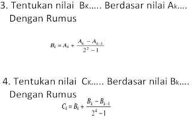

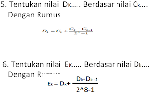

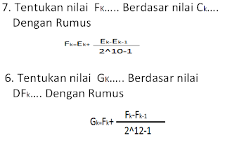

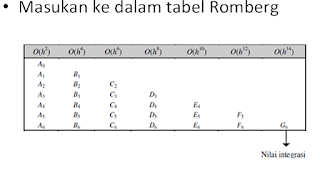

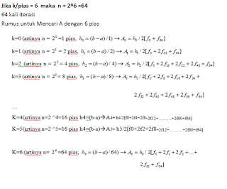

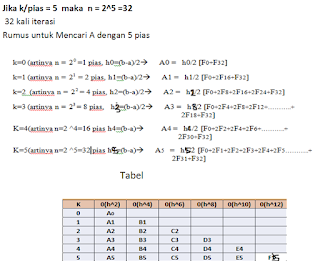

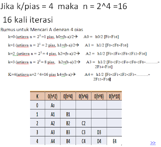

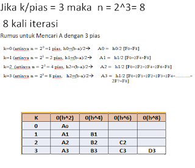

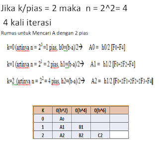

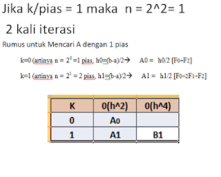

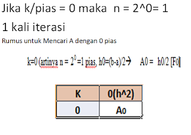

### **Contoh Soal :**

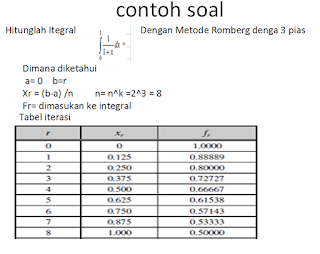

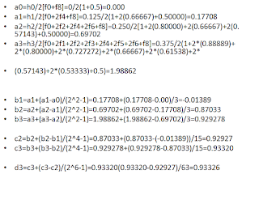

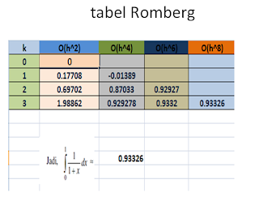

### **Code Program :**

```python
 # import numpy and scipy.integrate
import numpy as np import numpy as np
from scipy import integrate from integrate import scipy
gfg = lambda x: np.exp( - x * * 2 ) gfg = lambda x: np.exp( - x * * 2 )
 
# using scipy.integrate.romberg()
geek = integrate.romberg(gfg, 0 , 3 , show = True ) geek = integrate.romberg(gfg, 0 , 3 , show = True )
 
print (geek)
```

run

```python
    Romberg integration of <function vectorize1..vfunc at 0x00000209C3641EA0> from [0, 3] Romberg integrasi <function vectorize1..vfunc di 0x00000209C3641EA0> dari [0, 3]

     Steps StepSize Results Langkah StepSize Hasil
         1 3.000000 1.500185 1 3.000000 1.500185
         2 1.500000 0.908191 0.710860 2 1.500000 0,908191 0,710860
         4 0.750000 0.886180 0.878843 0.890042 4 0.750000 0.886180 0.878843 0.890042
         8 0.375000 0.886199 0.886206 0.886696 0.886643 8 0.375000 0.886199 0.886206 0.886696 0.886643
        16 0.187500 0.886205 0.886207 0.886207 0.886200 0.886198 16 0.187500 0.886205 0.886207 0.886207 0.886200 0.886198
        32 0.093750 0.886207 0.886207 0.886207 0.886207 0.886207 0.886207 32 0,093750 0.886207 0.886207 0.886207 0.886207 0.886207 0.886207
        64 0.046875 0.886207 0.886207 0.886207 0.886207 0.886207 0.886207 0.886207 64 0.046875 0.886207 0.886207 0.886207 0.886207 0.886207 0.886207 0.886207
       128 0.023438 0.886207 0.886207 0.886207 0.886207 0.886207 0.886207 0.886207 0.886207 128 0.023438 0.886207 0.886207 0.886207 0.886207 0.886207 0.886207 0.886207 0.886207

    The final result is 0.8862073482595311 after 129 function evaluations. Hasil akhir adalah 0,8862073482595311 setelah 129 evaluasi fungsi.

```

